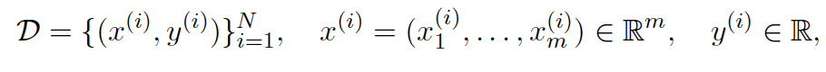
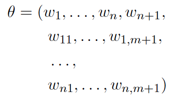
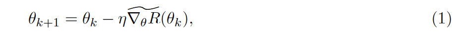
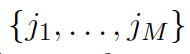

## Problem Statement
The problem statement is to use stochastic gradient descent to update the gradients of a one hidden layer neural network to minimize the training loss until it ceases to decrease any further. 

For a given dataset, 

a neural network with one hidden layer approximates the map from $x_{i}$ to $y_{i}$ using the following equation:

$$
f(x ; \theta)=\sum_{j=1}^{n} w_{j} \sigma\left(\sum_{k=1}^{m} w_{j k} x_{k}+w_{j, m+1}\right)+w_{n+1}
$$

where 


is the set of all parameters in the model and $\sigma: \mathbb{R} \rightarrow \mathbb{R}$ is a non-linear activation function. The stochastic gradient method aims to solve the following minimization problem:

$$
\min _{\theta} R(\theta)=\frac{1}{2 N} \sum_{i=1}^{N}\left|f\left(x^{(i)} ; \theta\right)-y^{(i)}\right|^{2}
$$

To find the optimal value of $\theta$, we start with an initial guess $\theta_{0}$, 

and update the solution with 

where $\eta$ is the learning rate, and $\widetilde{\nabla_{\theta} R}$ is the approximation of the gradient

$$
\nabla_{\theta} R(\theta)=\frac{1}{N} \sum_{i=1}^{N}\left[f\left(x^{(i)} ; \theta\right)-y^{(i)}\right] \nabla_{\theta} f\left(x^{(i)} ; \theta\right) .
$$

The approximation is done by randomly drawing $M$ distinct integers  from the set $\{1, \cdots, N\}$ and setting $\widetilde{\nabla_{\theta} R}$ to

$$
\widetilde{\nabla_{\theta} R}(\theta)=\frac{1}{M} \sum_{i=1}^{M}\left[f\left(x^{\left(j_{i}\right)} ; \theta\right)-y^{\left(j_{i}\right)}\right] \nabla_{\theta} f\left(x^{\left(j_{i}\right)} ; \theta\right)
$$

The random set  must be updated for every iteration (1). The iteration terminates when $R\left(\theta_{k}\right)$ no longer decreases.

## Dataset
The dataset we want to execute the solution to the problem statement is nytaxi2022.csv which has $39656098$ rows and $19$ attributes. The attributes of which are described as below (source: [Kaggle](https://www.kaggle.com/datasets/diishasiing/revenue-for-cab-drivers)) :
- VendorID: A unique identifier for the taxi vendor or service provider.
- tpep_pickup_datetime: The date and time when the passenger was picked up.
- ttpep_dropoff_datetime: The date and time when the passenger was dropped off.
- tpassenger_count: The number of passengers in the taxi.
- trip_distance: The total distance of the trip in miles or kilometers.
- RatecodeID: The rate code assigned to the trip, representing fare types.
- store_and_fwd_flag: Indicates whether the trip data was stored locally and then forwarded later (Y/N).
- PULocationID: The unique identifier for the pickup location (zone or area).
- DOLocationID: The unique identifier for the drop-off location (zone or area). 
- payment_type: The method of payment used by the passenger (e.g.,  cash, card).
- fare_amount: The base fare for the trip.
- extra: Additional charges applied during the trip (e.g., night surcharge).
- mta_tax: The tax imposed by the Metropolitan Transportation Authority.
- tip_amount: The tip given to the driver, if applicable.
- tolls_amount: The total amount of tolls charged during the trip.
- improvement_surcharge: A surcharge imposed for the improvement of services.
- total_amount: The total fare amount, including all charges and surcharges.
- congestion_surcharge: An additional charge for trips taken during high traffic congestion times.

## Requirements
- The code should work for any number of processes.
-  The dataset is stored nearly evenly among processes, and the algorithm should not send the local dataset to other processes, except when reading the data.
-  Split the dataset into a training set (70%) and a test set (30%).
-  Predict the total fare amount (column total_amount) using the following columns as features: tpep_pickup_datetime,tpep_dropoff_datetime,passenger_count,trip_distance,RatecodeID,PULocationID
    DOLocationID, payment_type,extra
-  You may need to preprocess of the data by dropping some incomplete rows and normalizing the data.

-  All processes should compute the stochastic gradient $\widetilde{\nabla_{\theta} R}$ in parallel.
-  Once the solution $\theta$ is found, the code can compute the RMSE in parallel.

## Approach
### Exploratory Data Analysis
Since the given dataset was huge to effectively process locally on my machine in a distributed setting, I performed the following exploratory data analysis (not distributed) in a Jupyter notebook:

- I loaded the input file using the pandas' library's read_csv function while parsing the datetime attributes tpep_pickup_datetime, tpep_dropoff_datetime the first time and cached the entire dataframe as a pickle file to speed up subsequent runs
- I checked the percentage of missing data in columns across the dataframe which was $3.450423$%, since the fraction was small, I chose to drop the rows with any missing data
- I checked for duplicate rows to prevent bias during training. Since there was only 1 duplicate row, I dropped that row
- I converted the pickup/dropoff datetime attributes to year, month, date, hour, minute, second and computed the trip duration in minutes between the pickup and dropoff times. I subsequently dropped the original datetime attributes as the derived attributes are sufficient to use for training and evaluation purposes.
- I dropped the rows where trip_duration was either non-positive or over 3 hours to eliminate any noisy/invalid data
- I dropped the rows with negative values of extra and the non-positive values of total_amount. As I further analyzed the range of values of total_amount, I noticed extremely high values and hence chose to winsorize $0.5$% of the dataset i.e. clipped the data between $0.5$ percentile and $99.5$ percentile to be conservative with the removal of the outliers. This cleared up $0.9394557120998955$ % of the dataset.
- Since the distribution of total_amount is right skewed, I updated the response variable to its log equivalent so as to make the distribution of the response variable more symmetric.
- I checked the frequency counts of the categorical variables i.e. RatecodeID, payment_type, PULocationID, DOLocationID to determine the encoding to use for them. Since RatecodeID, payment_type only have 7 and 6 values respectively, I chose to perform one-hot encoding for them. Since PULocationID, DOLocationID have 262 values each, one hot encoding could significantly impact training times hence I chose frequency encoding for them to keep the dimensionality low.
- I did a log transformation of the response variable since it was right skewed so as to make the distribution more symmetric and to reduce the impact of outliers.
- I performed a final round of checks to ensure the data was clean before writing the data to another csv for modeling the Neural Net.

The exploratory data analysis concluded with a reduction from $39656098$ rows to $37603658$ rows through removal of outliers, duplicates, invalid data alongside the necessary transformation of given columns through datetime attribute extraction, encoding etc. to have $30$ features (excluding the response variable total_amount)

### Distributed System
The distributed system comprises the following key components that each execute in parallel across different processes:
- IO and data splitting between train and test : Reading the processed input from the previous step and splitting the data between test and train 
- Normalizer: Normalizing the train features and labels, using their mean and stddev to normalize the test data
- Neural Network : Trains the model using Stochastic Gradient Descent for batch updates on the test data until the loss is within a threshold and evaluates the model using the test data. 


#### IO and splitting the data between test and train

The IO and test-train split can be summarized as below:

Since one of the requirements is to store data nearly evenly among processes, the process with rank $0$ counts the number of rows in the input file and then broadcasts the count to the other processes using the MPI broadcast function:
    
```
num_rows_total = comm.bcast(n_rows, root=0)       
```

Since the other processes are aware of the total number of rows, each process locally determines the number of rows it needs to read based on its rank. The start index, end index and skiprows are computed using the rank, and this makes the split among all processes nearly uniform.

To make the reading more efficient, we perform a chunk-based reading of the processed file with a chunk size of $100000$
 
For each process, their local chunks are split into test and train - this is done by generating a permutation of indices using RNG and splitting the indices between test and train.

#### Normalizer
Within each process, the normalizer executes the standard scaling logic, i.e. centering the data to the global training mean and dividing by the global training stddev (non-zero).
The global training mean and global training stddev for the training features are computed using the MPI allreduce function:

```
feature_fields = comm.allreduce((local_feature_sum, local_feature_count), op=MPI.SUM)
global_feature_sum, global_feature_count = feature_fields[0], feature_fields[1] 
```


The global training mean and global training stddev for the training labels are computed in a similar manner.

These means and stddevs are used to normalize the testing data.

Since I was looking to determine the impact of not normalizing the feature-encoded attributes, I added the functionality of skipping normalization for certain columns to evaluate the impact of doing so on the experiments.

#### Neural Network
The One Hidden Layer Neural Network has the following steps that are applied in the training stage:
- Forward propagation: Starting off with random weights, the input data (i.e. features from the processed data) is passed on to a hidden layer which then generates an output. So the activation is calculated on the weighted sum of inputs which on another weighted summation forms the output
- Backward propagation: The predicted output generated by forward propagation is then compared against the actual output to adjust the weights and the bias at the hidden layer and then backpropagate it to adjust the weights and bias at the input layer using derivative of the chosen activation function. 
- Gradient update: The weights are adjusted based on the applicable learning rate and gradients. The gradients are computed at a batch level (using M integers drawn at random), they are the calculated using global_summed_gradients and global_count, obtained by MPI's allreduce function on local weighted gradients (weighted as the sizes of batches may vary) and local count respectively.

These steps are continuously repeated within a batch until the difference between the loss computed for a batch of data and its previous batch are within a certain chosen threshold (either $1e-5$ or $1e-6$ as noted in the Results section or the Improvements Attempts sections). This approximation of global loss at the batch level is used as a stopping criterion to exit training. The train RMSE is calculated using the updated weights/bias on the full train dataset.

The evaluation stage uses the weights computed in the training stage to predict the labels, the test RMSE is computed similar to how the train RMSE is computed. 

Additional notes:
- Weight initialization: The starting weights are initialized based on the activation function to ensure faster
    convergence following (Reference: [DeepLearning.AI Weight Initialization](https://www.deeplearning.ai/ai-notes/initialization/index.html))
- Learning rate initialization: I initialized the learning rate as a constant at first, the RMSE and convergence results were not satisfactory. I then tried using a Cyclic Scheduler Learning Rate (Reference: [Learning Rate Schedulers](https://machinelearningmastery.com/a-gentle-introduction-to-learning-rate-schedulers/)), while the test RMSE is within 0.05 of the train RMSE or even lower than the RMSE indicating a good generalization, the learning rate set was not accounting for number of processes resulting in more iterations and a slower convergence 


## Results and Improvements
They have been documented in the report in detail using the plotting and tables generated using inference.ipynb under the Jupyter notebooks folder.

## How to run the code
As a pre-requisite, ensure that you have Python and MPI set up in the machine you are looking to execute this code on.

Firstly run all the cells of the Jupyter notebook called exploratory_data_analysis.ipynb . This notebook expects the input NY taxi dataset to in "../../data/nytaxi2022.csv" or in "../../data/nytaxi2022.pkl" (for faster processing). The output generated by the Jupyter notebook is pre-processed and also has some new features introduced (this has been described in detail in #Exploratory Data Analysis). This preprocessed file is then written to ../../data/processed/nytaxi2022_preprocessed_final.csv, this file path will be used as an input in the next step to execute the SGD on one hidden layer NN using MPI.

The input expected is along the following lines (NOTE: this will only spin up one process):

```
python main.py <file_path> <test_ratio> <hidden_dimensions> <learning_rate> <activation_function> <max_iterations> <batch_size> <seed> <debug (y/n)>
```
The validations executed on the inputs are as below:
1. The file path must be valid
2. The test ratio must be a float value between 0 and 1 (both upper and lower bounds being excluded)
3. Hidden dimensions must be a positive integer
4. Learning rate must be a positive integer
5. Activation function must be one of "relu", "sigmoid", "tanh", "leaky_relu", "elu"
6. Max iterations must be a positive integer
7. Batch size must be a positive integer
8. Seed must be a positive integer
9. Debug must be either "y" or "n", this is to ensure one sees the debugging logs only if they truly want to.

To run this in a distributed setting using MPI, you can do one of the following:

1. You can simply add the  `mpiexec -n <num_processes>` as a prefix to the above command such as below:

```
mpiexec -n 4 python main.py "../data/processed/nytaxi2022_preprocessed_final.csv" 0.3 16 0.00001 leakyrelu 1000000 32 42 y
```

2. You may choose to run the mpiruns.sh file from your workspace, this already has the experiment parameters configured. You can use the shell script as is or modify the parameters to your liking.
Once you have the parameters of interest ready, run the code (when you have changed your directory to the src folder within the repository), you can run `./mpiruns.sh`

This code generates logs that will be written to ../../logs/final that includes the 
|___ train_test_rmse.csv : Data for the final iteration of each run so as to enable
      plotting i)the train-test RMSE, ii) the training times (avg/max) for each activation function/batch combination.
|___ training_metrics.csv: Data for each iteration of each run so as to enable
      plotting i) the training loss against the number of iterations for each activation function/batch size configuration, ii) learning rate trend for the choice of the learning rate,
      